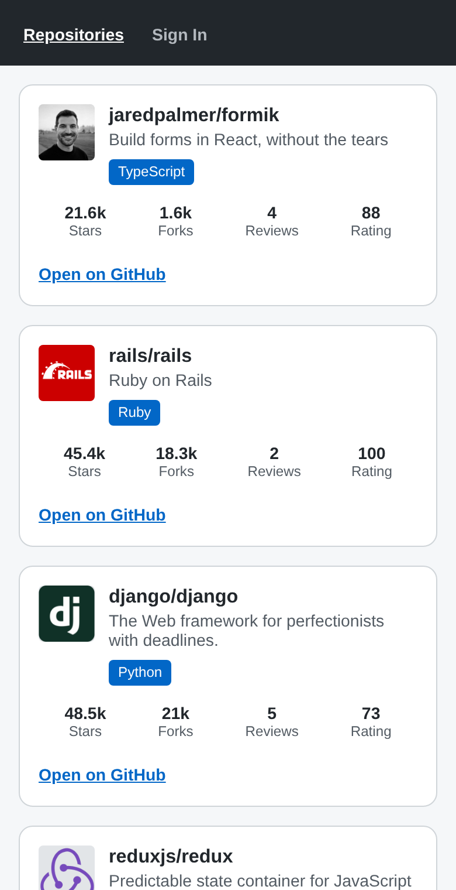
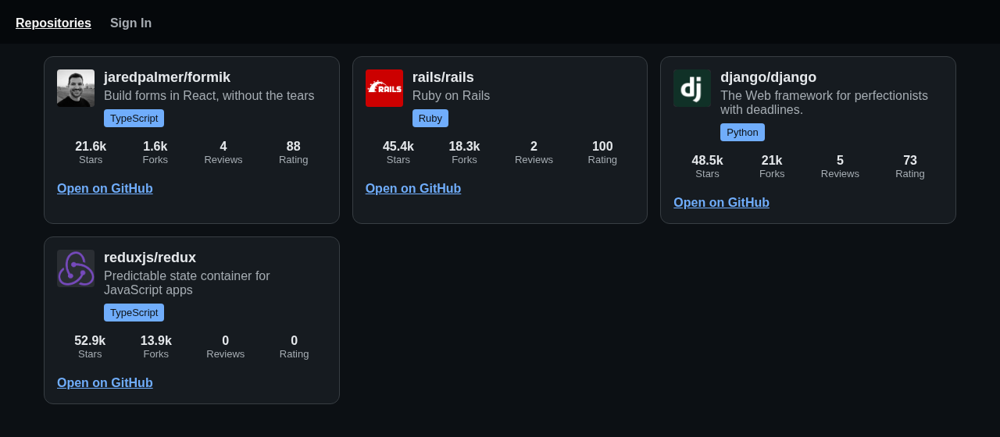

# Repository Rate

A React Native app that lists GitHub repositories with their stars, forks, reviews and rating. It runs on Android, iOS and the web from the same code.

## Demo

Live web version: https://diegomottadev.github.io/repository-rate-app/

The web demo uses the mock data in `src/api/mocks/`, because the course API runs on your own machine.

| Phone, light mode | Desktop, dark mode |
| --- | --- |
|  |  |

## What it does

- Shows a list of repositories. Each card has the owner's avatar, the name, the description, the language, 4 stats and a link to the repo on GitHub.
- Loads the list from the rate-repository API when you set `API_URL`. Without it, the app uses local mock data.
- While loading, you see skeleton cards. If the request fails, you get the error and a "Try again" button. On a phone you can also pull down to refresh.
- Has a sign in form with validation (Formik + Yup). There's no real login yet (see [Known issues](#known-issues)).
- Follows the system light or dark mode, and the grid goes from 1 to 3 columns as the screen gets wider.
- Works with screen readers and the keyboard: roles and labels on everything, 44px touch targets, a visible focus ring on the web, and no pulse animation when "reduce motion" is on.

## Stack

- [Expo](https://expo.dev) SDK 57, React 19.2, React Native 0.86
- react-native-web 0.21 for the web build (bundled with Metro)
- React Router 7 (`MemoryRouter`)
- Formik 2 and Yup 1 for the form
- PropTypes, checked by ESLint (`react/prop-types`), since React 19 dropped the runtime check
- Jest 29 + jest-expo + React Native Testing Library 14
- ESLint 9 (eslint-config-expo) and Prettier 3

## Getting started

You need Node 22.13 or newer (I use Node 24) and npm.

```bash
git clone https://github.com/diegomottadev/repository-rate-app.git
cd repository-rate-app
npm install
npm start
```

`npm start` opens the Expo dev server. Scan the QR code with [Expo Go](https://expo.dev/go) on your phone, or press `a` for Android, `i` for iOS or `w` for the web.

To use the real API, run the [rate-repository-api](https://github.com/fullstack-hy2020/rate-repository-api) from Full Stack Open and pass its address. Use your computer's LAN IP, because `localhost` on the phone is the phone itself:

```bash
API_URL=http://192.168.0.103:5000 npm start
```

## Scripts

| Command | What it does |
| --- | --- |
| `npm start` | Expo dev server |
| `npm run android` / `ios` / `web` | Dev server opened on that platform |
| `npm run build` | Static web build in `dist/` |
| `npm run build:pages` | Same build, served from `/repository-rate-app/` |
| `npm run deploy` | Builds and publishes to GitHub Pages |
| `npm test` | Runs the tests |
| `npm run lint` | ESLint |
| `npm run format` | Formats everything with Prettier (`format:check` only checks) |

## Deploy

The web version lives on GitHub Pages, in the `gh-pages` branch.

```bash
npm run deploy
```

`scripts/deploy.sh` builds the app with the `/repository-rate-app/` base path, copies `dist/` into a temporary git worktree on `gh-pages`, adds a `.nojekyll` file and pushes. Your working copy and current branch stay as they are. It never force-pushes, so if `gh-pages` moved on the remote the push fails and you decide what to do.

To see what it would publish without committing anything:

```bash
DRY_RUN=1 npm run deploy
```

The first time, turn on Pages for the `gh-pages` branch in Settings → Pages.

## Project structure

```
App.jsx                  ThemeProvider + router + Main
index.js                 entry point (registerRootComponent)
app.config.js            adds API_URL and BASE_URL from the environment
public/index.html        web template: zoom on, focus ring, reduced motion
scripts/deploy.sh        GitHub Pages deploy
src/
  Main.jsx               app bar + routes
  api/                   the only code that talks to the API (+ mocks/)
  hooks/                 useRepositories, useReducedMotion
  pages/                 Repositories (the only component with app state), LogIn
  components/<Name>/     <Name>.jsx + styles.js + index.js
  constants/             config arrays: tabs, stats, form fields, API URL
  theme/                 tokens, createTheme, ThemeProvider, useThemedStyles
  types/                 shared PropTypes
  utils/                 pure functions
  schemas/               Yup schemas
  testUtils/             render helper for tests
```

Every component gets its data through props. Only `pages/Repositories` holds app state, through `useRepositories`.

## How to extend it

Most changes are one line in a config array.

**Add a stat to the cards.** Add an entry to `src/constants/repositoryStats.js`:

```js
{ key: 'watchersCount', label: 'Watchers', format: formatCount }
```

**Add a screen.** Add the tab to `src/constants/navigation.js` and the `<Route>` in `src/Main.jsx`.

**Add a field to the sign in form.** Add it to `src/constants/loginForm.js` and to the Yup schema in `src/schemas/loginSchema.js`.

**Add a color.** Add it to both palettes in `src/theme/tokens.js` as `[lightness, chroma, hue]` in OKLCH. `createTheme` turns it into hex, because React Native doesn't understand `oklch()`. Check the contrast in light and dark mode.

**Add a component.** Create `src/components/<Name>/` with `<Name>.jsx`, `styles.js` (a `createStyles = theme => ({...})` function) and `index.js`. Use `useThemedStyles(createStyles)` and declare `propTypes`.

## Tests

```bash
npm test
```

There are 57 tests in 11 files, next to the code they test (`*.test.js` / `*.test.jsx`).

- Unit tests for every function in `utils/`, the theme, and `api/repositories` with a mocked `fetch`.
- Integration tests with React Native Testing Library: loading skeletons, the list, the empty state, the error and retry, aborting the request on unmount, the GitHub link, tab navigation and the sign in validation.

React Native Testing Library 14 is async, so `render` and `fireEvent` need `await`. The tests use `userEvent` and look things up by role, label or text.

## Known issues

- **Sign in doesn't log you in.** Submitting a valid form only logs the values to the console. There's no auth backend.
- **`npm audit` reports 46 high severity issues.** They all come from 2 packages, `braces@3.0.3` and `node-forge@1.4.0`, which Metro, Jest and Expo's CLI use. Neither has a fixed version yet, and neither ends up in the app bundle.
- **I haven't tried the SDK 57 version on a real phone yet.** I checked it with the tests and the web build. The upgrade jumped 8 SDKs, so a phone test comes next.
- The background and focus colors in `public/index.html` are copied by hand from `src/theme/tokens.js`. If you change them in one place, change the other.
- The web bundle is about 900 KB (242 KB gzipped). Most of it is react-native-web, react-dom and React Router.

## Changelog

**October 2026**

- Upgraded Expo SDK 49 to 57: React 19.2, React Native 0.86, and Metro for the web build.
- Replaced react-router-native (there's no version 7) with React Router 7. This also fixed the open redirect advisories.
- Split the code into `api/`, `components/`, `constants/`, `theme/`, `types/` and `utils/`.
- Added design tokens in OKLCH, dark mode, fluid font sizes and a responsive grid.
- Added loading, empty and error states, with a retry button and pull to refresh.
- Accessibility: roles, labels, live regions, 44px targets, focus ring, reduced motion. Page zoom on the web is back.
- Fixed: Android showed a placeholder app bar with no tabs, the base font from the theme was never applied, fetch errors failed silently, a late response could update an unmounted screen, the form showed errors for fields you hadn't touched yet, and an empty language badge appeared when a repo had no language.
- Added Jest and React Native Testing Library tests, ESLint, Prettier and the GitHub Pages deploy.

**September and October 2023**

- First version: repository list with FlatList, app bar with tabs, routing, theme, sign in form with Formik and Yup, and loading data from the API.

## Credits

- I built this app in 2023 while learning React Native, following the rate repository app exercise from [Full Stack Open](https://fullstackopen.com/en/part10), part 10, by the University of Helsinki.
- The API is [rate-repository-api](https://github.com/fullstack-hy2020/rate-repository-api) from the same course. The mock data in `src/api/mocks/` has the same shape.
- Avatars and repository data belong to their owners on GitHub.
